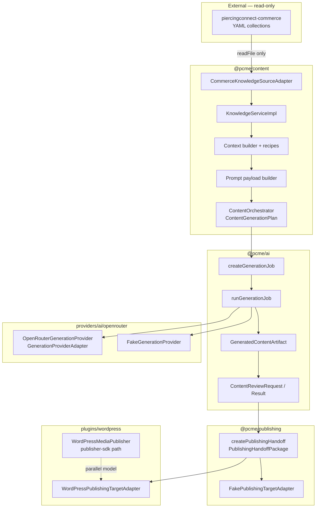

# PC Media Engine — Architecture Review v1.0

**Date:** 2026-07-10  
**Scope:** Sprints 021–034 (knowledge pipeline through WordPress publishing handoff)  
**Repo:** `pc-media-engine` @ `0.50.0-beta-rc`  
**Mode:** Read-only audit — no code changes  
**External constraint verified:** `piercingconnect-commerce` is not modified by PCME

---

## 1. Executive summary

After Sprints 021–034, PCME has a **coherent offline-first content generation pipeline** from read-only knowledge loading through AI generation, human review, publishing handoff, and a WordPress target adapter. Layer separation is **strong in the knowledge and prompt stages** and **acceptable in generation/review**, with deliberate adapter boundaries for providers and publishing targets.

The pipeline is **not production-ready for live multi-worker publishing**. Artifact storage, review history, and WordPress idempotency are **in-memory and process-local**. The new handoff path **does not use the documented PublishingOutbox/worker model** and runs synchronously through `PublishingTargetAdapter.publish()`.

**Strengths:** read-only commerce loading with path containment; blocked-field projection and prompt serialization; deterministic entity IDs; frozen immutable contracts; secret/path redaction in OpenRouter and WordPress adapters; draft-only WordPress smoke with credential gating.

**Primary risks:** lack of durable persistence, process-local idempotency, `@pcme/publishing` runtime coupling to `@pcme/ai`, dual WordPress publish entry points, and `sourcePath` present on operator-facing plan/snapshot types (mitigated from provider payloads).

**Decision:** **Conditional GO** to continue the next development phase (persistence + outbox integration). **NO-GO** for production live publishing until high-severity operational gaps are remediated.

| Severity | Count |
| -------- | ----- |
| Critical | 0 |
| High | 6 |
| Medium | 9 |
| Low | 7 |

---

## 2. Current architecture diagram

### 2.1 Implemented pipeline (Sprints 021–034)



### 2.2 Documented target architecture (not yet wired to handoff path)

From `docs/architecture/module-map.md` and `docs/architecture/system-overview.md`:

```
API → PublishingOutboxEntry → Worker → Renderer → Publisher → WordPress
```

The Sprint 033–034 handoff adapter path **short-circuits** this: approved packages call `PublishingTargetAdapter.publish()` directly with no outbox enqueue, no worker, and no Renderer stage.

### 2.3 Workspace boundaries

`pnpm-workspace.yaml` includes `apps/*`, `packages/*`, `plugins/*`, `providers/*/*`.

| Package | Runtime dependencies (focus) | Role |
| ------- | ------------------------------ | ---- |
| `@pcme/content` | `yaml` only | Knowledge, orchestration, prompt |
| `@pcme/ai` | `@pcme/content`, `@pcme/seo` | Generation jobs, artifacts, review |
| `@pcme/publishing` | `@pcme/ai` | Handoff + legacy publisher/orchestrator |
| `@pcme/provider-ai-openrouter` | `@pcme/ai`, `@pcme/content`, `@pcme/seo` | OpenRouter adapter (+ smoke uses content) |
| `@pcme/plugin-wordpress` | `@pcme/publisher-sdk`, `@pcme/publishing` | WordPress handoff + legacy media publisher |

**No circular `package.json` dependencies** were found among these packages.

---

## 3. Strengths

1. **Clean knowledge layer isolation** — `@pcme/content` has no `@pcme/*` imports in source; only `yaml` as a runtime dependency (`packages/content/package.json`). Orchestrator prepares plans without invoking AI (`packages/content/src/orchestrator/prepare.ts`).

2. **Read-only commerce source-of-truth** — Production loader uses read-only filesystem APIs (`packages/content/src/commerce/collection-loader.ts`, `packages/content/src/commerce/loader.ts`). Write operations appear only in tests (`packages/content/src/commerce/__tests__/loader.test.ts`). Adapter is explicitly read-only (`packages/content/src/knowledge/adapters/commerce-adapter.ts`).

3. **Defense-in-depth path/secret blocking** — Blocked fields in projection (`packages/content/src/knowledge/context/projection.ts`), prompt serialization (`packages/content/src/prompt/serialize.ts`), job validation (`packages/ai/src/generation/validate.ts`), and handoff validation (`packages/publishing/src/handoff/validate.ts`).

4. **Deterministic pipeline IDs** — `buildDeterministicRequestId`, `buildDeterministicJobId`, `buildDeterministicArtifactId`, `buildDeterministicReviewId`, `buildDeterministicHandoffId` all use SHA-256 over canonical JSON inputs (`packages/content/src/orchestrator/warnings.ts`, `packages/ai/src/generation/create-job.ts`, `packages/ai/src/generation/artifact/create-artifact.ts`, `packages/ai/src/generation/review/create-request.ts`, `packages/publishing/src/handoff/create-handoff.ts`).

5. **Immutable frozen contracts** — Plans, handoff packages, snapshots, and store clones use `Object.freeze` (`packages/content/src/orchestrator/prepare.ts`, `packages/publishing/src/handoff/create-handoff.ts`, `packages/content/src/knowledge/snapshot.ts`).

6. **Append-only review history** — `InMemoryContentReviewStore.submitDecision` and `reopenAfterRevision` push history events without mutating prior entries (`packages/ai/src/generation/review/store.ts`).

7. **Provider adapter boundary** — OpenRouter implements `GenerationProviderAdapter` with timeout, abort, and redacted errors (`providers/ai/openrouter/src/openrouter-generation.provider.ts`, `providers/ai/openrouter/src/openrouter-generation-errors.ts`).

8. **Live publish safeguards in smoke** — WordPress smoke is draft-only with `forceDraft: true` and credential skip (`plugins/wordpress/src/scripts/wordpress-publish-smoke.ts`, `plugins/wordpress/src/handoff-mapper.ts`).

9. **Strong unit test coverage in focus packages** — ~372 test cases across content, ai, publishing, wordpress, and openrouter (see §8).

10. **YAML parser not publicly exposed** — `parseYaml` is internal to `packages/content/src/commerce/collection-loader.ts`; `packages/content/src/commerce/index.ts` exports loader helpers and path utilities, not the `yaml` package.

---

## 4. Findings by severity

### 4.1 Critical (0)

No confirmed critical findings. Commerce remains read-only, provider payloads omit blocked path fields (verified by tests), and smoke publishing defaults to draft-only.

---

### 4.2 High (6)

#### H-1 — Artifact, review, and handoff idempotency stores are in-memory only

| | |
| --- | --- |
| **Impact** | Data loss on process restart; unbounded memory growth; no cross-worker consistency |
| **Evidence** | `InMemoryGeneratedContentArtifactStore` — `packages/ai/src/generation/artifact/store.ts` (comment: "tests and offline development only"); `InMemoryContentReviewStore` — `packages/ai/src/generation/review/store.ts`; `InMemoryWordPressHandoffIdempotencyStore` — `plugins/wordpress/src/handoff-idempotency.ts` (comment: "tests/offline only") |
| **Type** | Confirmed |

#### H-2 — WordPress handoff idempotency is process-local

| | |
| --- | --- |
| **Impact** | Duplicate WordPress posts under multi-worker or retry without shared dedup |
| **Evidence** | Default store is `new InMemoryWordPressHandoffIdempotencyStore()` in `WordPressPublishingTargetAdapter` constructor (`plugins/wordpress/src/wordpress-publishing-target.adapter.ts` lines 73–74) |
| **Type** | Confirmed |

#### H-3 — Handoff path bypasses documented PublishingOutbox/worker model

| | |
| --- | --- |
| **Impact** | No durable enqueue, retries, or audit trail integration for the new pipeline; diverges from architecture docs |
| **Evidence** | Module map rule 9: "Domain packages MUST NOT call external publish APIs — enqueue via PublishingOutbox" (`docs/architecture/module-map.md`); handoff calls `adapter.publish()` synchronously (`plugins/wordpress/src/wordpress-publishing-target.adapter.ts`); no `PublishingOutboxEntry` usage in handoff module (`packages/publishing/src/handoff/`) |
| **Type** | Confirmed |

#### H-4 — `@pcme/publishing` runtime-depends on `@pcme/ai`

| | |
| --- | --- |
| **Impact** | Publishing layer is coupled to generation-domain types; future products cannot publish pre-generated content without pulling AI package |
| **Evidence** | `packages/publishing/package.json` lists `@pcme/ai` under `dependencies`; `packages/publishing/src/handoff/types.ts` imports `GeneratedContentArtifact`, `ContentReviewResult`, `GenerationPolicySnapshot` from `@pcme/ai` |
| **Type** | Confirmed |

#### H-5 — Dual WordPress publishing models coexist

| | |
| --- | --- |
| **Impact** | Operator/integration confusion; capability drift (`update: false` vs handoff POST behavior) |
| **Evidence** | Legacy: `WordPressMediaPublisher` + `wordPressRegistration` (`plugins/wordpress/src/registration.ts`, `plugins/wordpress/src/wordpress-media.publisher.ts`); Handoff: `WordPressPublishingTargetAdapter` (`plugins/wordpress/src/wordpress-publishing-target.adapter.ts`); `WORDPRESS_CAPABILITIES.update: false` (`plugins/wordpress/src/registration.ts` line 37) |
| **Type** | Confirmed |

#### H-6 — No orchestration-layer job cancellation or timeout

| | |
| --- | --- |
| **Impact** | Long-running provider calls cannot be cancelled from pipeline orchestrator; only provider-local timeout/abort exists |
| **Evidence** | `runGenerationJob` has no `AbortSignal` or timeout parameter (`packages/ai/src/generation/run.ts`); cancellation exists only inside OpenRouter provider (`providers/ai/openrouter/src/openrouter-generation.provider.ts`) |
| **Type** | Confirmed |

---

### 4.3 Medium (9)

#### M-1 — Commerce adapter is the default knowledge source

| | |
| --- | --- |
| **Impact** | Lumora/GagBox integrations must override defaults or inherit PiercingConnect coupling |
| **Evidence** | `KnowledgeServiceImpl` defaults to `new CommerceKnowledgeSourceAdapter()` (`packages/content/src/knowledge/service.ts` lines 64–67); top-level export leads with commerce (`packages/content/src/index.ts`) |
| **Type** | Confirmed |

#### M-2 — `sourcePath` on public plan and snapshot metadata

| | |
| --- | --- |
| **Impact** | Absolute repo paths can leak to operator logs, API responses, or dashboards if plans/snapshots are serialized verbatim |
| **Mitigation** | Blocked from prompt payload and provider job serialization (tests in `packages/content/src/prompt/__tests__/build-prompt-payload.test.ts`, `packages/ai/src/generation/__tests__/generation-job.test.ts`) |
| **Evidence** | `KnowledgeSnapshotMetadata.sourcePath` (`packages/content/src/knowledge/types.ts` line 28); included in `ContentGenerationPlan.snapshot` (`packages/content/src/orchestrator/types.ts` line 65); propagated in `toPublicSnapshot` (`packages/content/src/knowledge/service.ts` line 228) |
| **Type** | Confirmed (risk partially mitigated) |

#### M-3 — Commerce error formatting includes file paths

| | |
| --- | --- |
| **Impact** | Loader errors surfaced via `formatCommerceKnowledgeError` may expose absolute paths in logs |
| **Evidence** | `formatCommerceKnowledgeError` appends `file=${error.filePath}` (`packages/content/src/commerce/errors.ts` lines 21–22) |
| **Type** | Confirmed |

#### M-4 — `@pcme/provider-ai-openrouter` lists `@pcme/content` as runtime dependency

| | |
| --- | --- |
| **Impact** | Unnecessary coupling in dependency graph; suggests provider layer depends on commerce orchestration |
| **Mitigation** | Production provider source imports only `@pcme/ai` and `@pcme/seo`; `@pcme/content` used in smoke scripts only (`providers/ai/openrouter/src/scripts/*.ts`) |
| **Evidence** | `providers/ai/openrouter/package.json` lines 26–29 |
| **Type** | Confirmed |

#### M-5 — Documentation drift vs implemented scope

| | |
| --- | --- |
| **Impact** | Onboarding and architectural decisions based on stale docs |
| **Evidence** | `README.md` says "Sprint 2 — database foundation"; `ROADMAP.md` says "Sprint 0 complete · Sprint 1 next" and `v0.1.0-alpha`; root `package.json` is `0.50.0-beta-rc` with extensive smoke scripts |
| **Type** | Confirmed |

#### M-6 — Architecture docs describe Renderer/Outbox not used by handoff path

| | |
| --- | --- |
| **Impact** | New contributors may implement against the wrong publish flow |
| **Evidence** | `docs/architecture/module-map.md` (Renderer, PublishingOutbox); `docs/architecture/wordpress-publishing-flow.md`; handoff module has no renderer integration (`packages/publishing/src/handoff/`) |
| **Type** | Confirmed |

#### M-7 — Legacy `PublishingOrchestrator` coexists with handoff contracts

| | |
| --- | --- |
| **Impact** | Two publishing APIs (`PublishingRequest`/`Publisher` vs `PublishingHandoffPackage`/`PublishingTargetAdapter`) |
| **Evidence** | `packages/publishing/src/index.ts` exports both handoff and `PublishingOrchestrator`; tests cover legacy path (`packages/publishing/src/__tests__/publishing-orchestrator.test.ts`) |
| **Type** | Confirmed |

#### M-8 — Knowledge snapshot refresh can replace in-flight load promise

| | |
| --- | --- |
| **Impact** | Concurrent callers during refresh may observe mixed snapshot generations |
| **Evidence** | `snapshotPromise` overwritten on refresh in `KnowledgeServiceImpl` (`packages/content/src/knowledge/service.ts`) |
| **Type** | Future risk (confirmed code pattern; impact under concurrent refresh not load-tested) |

#### M-9 — No automated cross-package integration test for full pipeline including WordPress adapter

| | |
| --- | --- |
| **Impact** | Regressions at package boundaries may slip until manual smoke |
| **Evidence** | Handoff test uses `FakePublishingTargetAdapter` (`packages/publishing/src/handoff/__tests__/publishing-handoff.test.ts`); WordPress adapter tested in isolation (`plugins/wordpress/src/__tests__/wordpress-publishing-target.adapter.test.ts`); no single test file chains content → ai → publishing → wordpress |
| **Type** | Confirmed |

---

### 4.4 Low (7)

#### L-1 — `snapshotId` uses `randomUUID()` (non-deterministic)

| | |
| --- | --- |
| **Evidence** | `packages/content/src/knowledge/snapshot.ts` line 40 |
| **Type** | Confirmed — acceptable for session identity; differs from deterministic entity IDs |

#### L-2 — Review history event IDs use `randomUUID()`

| | |
| --- | --- |
| **Evidence** | `packages/ai/src/generation/review/store.ts` lines 97, 129 |
| **Type** | Confirmed — append-only semantics preserved |

#### L-3 — Deprecated type alias retained

| | |
| --- | --- |
| **Evidence** | `CreatePublishingHandoffInput` deprecated in favor of `PublishingHandoffRequest` (`packages/publishing/src/handoff/types.ts` lines 85–86) |
| **Type** | Confirmed |

#### L-4 — Commerce-prefixed vs generic factory naming

| | |
| --- | --- |
| **Evidence** | `createCommerceContentOrchestrator` vs `createContentOrchestrator` (`packages/content/src/orchestrator/orchestrator.ts`); `buildCommercePromptPayload` vs generic builders (`packages/content/src/prompt/index.ts`) |
| **Type** | Confirmed |

#### L-5 — Status vocabulary overlap (`approved` vs `published`)

| | |
| --- | --- |
| **Evidence** | `GeneratedContentStatus` includes `approved` (`packages/ai/src/generation/artifact/types.ts`); `PublishingHandoffStatus` includes `published` (`packages/publishing/src/handoff/types.ts`) |
| **Type** | Confirmed — semantically distinct layers but naming requires care |

#### L-6 — `@pcme/core` remains empty scaffold

| | |
| --- | --- |
| **Evidence** | `packages/core/src/index.ts` exports `{}`; docs assign Organization/Project context and audit interface to core (`docs/architecture/module-map.md`) |
| **Type** | Confirmed |

#### L-7 — `@pcme/plugin-ghost` is stub-only (no handoff adapter)

| | |
| --- | --- |
| **Evidence** | `plugins/ghost/package.json` depends on publisher-sdk; no `PublishingTargetAdapter` implementation found |
| **Type** | Confirmed — expected for future work |

---

## 5. Technical debt register

| ID | Item | Layer | Priority | Effort |
| -- | ---- | ----- | -------- | ------ |
| TD-01 | Durable artifact + review repositories | `@pcme/ai` + `@pcme/database` | P0 | L |
| TD-02 | Shared publish-neutral contracts (`ArtifactRef`, `ReviewSummary`) decoupled from `@pcme/ai` | `@pcme/core` or `@pcme/shared` | P0 | M |
| TD-03 | Wire handoff to PublishingOutbox + worker | `@pcme/publishing`, `apps/worker` | P0 | L |
| TD-04 | Durable WordPress handoff idempotency store | `plugins/wordpress` + database | P0 | M |
| TD-05 | Consolidate WordPress publish paths | `plugins/wordpress` | P1 | M |
| TD-06 | Make commerce adapter opt-in on `createKnowledgeService()` | `@pcme/content` | P1 | S |
| TD-07 | Remove `sourcePath` from public snapshot metadata or gate behind debug | `@pcme/content` | P1 | S |
| TD-08 | Move `@pcme/content` to devDependency in openrouter provider | `providers/ai/openrouter` | P2 | S |
| TD-09 | Reconcile README/ROADMAP with 0.50.0-beta-rc scope | docs | P2 | S |
| TD-10 | Add orchestration-level cancellation/timeout to `runGenerationJob` | `@pcme/ai` | P2 | M |
| TD-11 | Full pipeline integration test (mock provider + mock WP fetch) | test harness | P2 | M |
| TD-12 | Ghost / second-platform `PublishingTargetAdapter` stub | `plugins/ghost` | P3 | M |

---

## 6. Production readiness matrix

| Layer | Classification | Rationale |
| ----- | -------------- | --------- |
| Commerce knowledge loader | **Production-ready with limitations** | Read-only, path-hardened; default repo discovery is dev-oriented (`packages/content/src/commerce/paths.ts`) |
| `CommerceKnowledgeSourceAdapter` | **Production-ready with limitations** | PiercingConnect-specific; works as adapter behind `KnowledgeService` |
| `KnowledgeServiceImpl` | **Local/offline only** | In-memory snapshot; no TTL/version pinning for multi-process |
| Context builder + recipes | **Production-ready with limitations** | Deterministic ordering; commerce recipes are PC-specific |
| Prompt payload builder | **Production-ready** | Safety constraints, blocked-field stripping, tested |
| Content orchestrator | **Production-ready with limitations** | Plan preparation only; exposes `sourcePath` in snapshot metadata |
| Generation job contract | **Production-ready** | Frozen, validated, deterministic IDs |
| `FakeGenerationProvider` | **Test-only** | `packages/ai/src/generation/fake-provider.ts` |
| OpenRouter generation adapter | **Production-ready with limitations** | Timeout/abort/redaction; single provider; network required |
| Generated content artifact | **Local/offline only** | No durable store implementation |
| Human review gate | **Local/offline only** | In-memory store; append-only history in-process only |
| Publishing handoff contract | **Production-ready** | Validation, immutability, deterministic IDs |
| `FakePublishingTargetAdapter` | **Test-only** | `packages/publishing/src/handoff/fake-adapter.ts` |
| WordPress handoff adapter | **Local/offline only** | Draft-safe smoke; in-memory idempotency; synchronous REST |
| `WordPressMediaPublisher` (legacy) | **Production-ready with limitations** | Mature tests; separate from handoff path; `update: false` |
| `PublishingOrchestrator` (legacy) | **Incomplete** relative to new pipeline | Coexists with handoff; not integrated with generation pipeline |
| Renderer / Outbox (documented) | **Incomplete** | Described in docs; not connected to Sprints 033–034 handoff |
| `@pcme/core` | **Incomplete** | Empty scaffold |
| `@pcme/plugin-ghost` | **Incomplete** | Stub plugin |

---

## 7. Missing tests

### 7.1 Present coverage (focus packages)

| Package | Test files | Approx. cases |
| ------- | ---------- | ------------- |
| `@pcme/content` | 9 | 79 |
| `@pcme/ai` | 5 | 64 |
| `@pcme/publishing` | 3 | 50 |
| `@pcme/plugin-wordpress` | 6 | 172 |
| `@pcme/provider-ai-openrouter` | 2 | 20 |
| **Focus total** | **25** | **~385** |

Smoke scripts exist at root (`package.json`: `commerce:smoke` through `wordpress-publish:smoke`).

### 7.2 Gaps

| Gap | Priority | Notes |
| --- | -------- | ----- |
| End-to-end pipeline test (content → ai → review → handoff → WP adapter with mocked fetch) | High | Only partial chain in `publishing-handoff.test.ts` with fake target |
| Durable store contract tests | High | No repository implementations to test |
| Multi-worker idempotency / concurrent publish | High | In-memory store untested under concurrency |
| Failure-path: provider timeout propagated through artifact/review/handoff | Medium | OpenRouter tests cover provider; not full chain |
| Failure-path: blocked handoff with path/secret in generated content | Medium | Handoff validate tests exist; limited artifact edge cases |
| Knowledge snapshot concurrent refresh | Medium | No test for `refreshSnapshot` race |
| Orchestrator cancellation mid-flight | Medium | Not implemented |
| Cross-package compatibility: publishing without `@pcme/content` devDep | Low | Structural only |
| Live OpenRouter integration test in CI | Low | Correctly opt-in via smoke scripts |

### 7.3 Confidence assessment

Current passing unit tests provide **strong confidence in contract validation, sanitization, and single-process happy paths**. They do **not** provide sufficient confidence for **production multi-worker publishing, durability, or outbox retry semantics**.

---

## 8. Recommended remediation order

1. **Extract publish-neutral shared types** — decouple `@pcme/publishing` from `@pcme/ai` (TD-02).
2. **Implement durable artifact + review stores** — Prisma repositories with immutability constraints (TD-01).
3. **Connect handoff to PublishingOutbox + worker** — align implementation with `docs/architecture/module-map.md` (TD-03).
4. **Durable WordPress idempotency** — shared store keyed by `handoffId` (TD-04).
5. **Consolidate WordPress paths** — deprecate or bridge legacy publisher-sdk vs handoff adapter (TD-05).
6. **Harden public metadata** — remove or redact `sourcePath` from operator-facing types (TD-07).
7. **Make commerce adapter explicit** — required adapter parameter on generic factories (TD-06).
8. **Add full pipeline integration test** with mocked provider and fetch (TD-11).
9. **Documentation reconciliation** (TD-09).
10. **Orchestration cancellation** (TD-10).

---

## 9. Go / no-go decision for the next phase

| Question | Decision |
| -------- | -------- |
| Proceed with next development sprints (persistence, outbox, boundary cleanup)? | **GO** |
| Deploy live WordPress publishing from the handoff path? | **NO-GO** |
| Onboard Lumora/GagBox without adapter/bootstrap work? | **NO-GO** (commerce defaults remain) |
| Treat current pipeline as production-ready? | **NO-GO** |

**Rationale:** The Sprint 021–034 contracts are sound and test-backed for offline/single-process use. Operational gaps (H-1 through H-3) block production publish and multi-project readiness.

---

## 10. Recommended follow-up sprints

| Sprint | Title | Goal | Key deliverables |
| ------ | ----- | ---- | ---------------- |
| **035** | Shared publish contracts | Decouple publishing from AI internals | Neutral types in `@pcme/core` or `@pcme/shared`; `@pcme/publishing` depends on shared types only; re-export compatibility shims |
| **036** | Durable generation stores | Persist artifacts and reviews | Prisma schema + repositories; immutability on create; append-only review history |
| **037** | Outbox handoff integration | Align publish with architecture docs | Enqueue `PublishingHandoffPackage`; worker invokes `PublishingTargetAdapter`; audit events |
| **038** | Durable publish idempotency | Cross-worker dedup | Shared idempotency store for WordPress handoff; retry policy |
| **039** | WordPress path consolidation | Single publish entry point | Deprecate or bridge `WordPressMediaPublisher` vs `WordPressPublishingTargetAdapter`; align capabilities |
| **040** | Platform bootstrap API | Multi-project readiness | Explicit adapter registration; remove commerce default; Lumora/GagBox fixture tests |
| **041** | Pipeline integration tests | Cross-package confidence | Mocked E2E test in CI; failure-path matrix |
| **042** | Docs + operator metadata hardening | Close M-2, M-3, M-5 | Redact paths in errors/public metadata; update README/ROADMAP/architecture docs |

---

## Appendix A — Layer boundary audit checklist

| Audit area | Status | Primary modules |
| ---------- | ------ | --------------- |
| Knowledge source adapters | ✅ Clear | `packages/content/src/knowledge/adapters/` |
| Knowledge service | ✅ Clear | `packages/content/src/knowledge/service.ts` |
| Context builder | ✅ Clear | `packages/content/src/knowledge/context/` |
| Prompt payload builder | ✅ Clear | `packages/content/src/prompt/` |
| Content orchestrator | ✅ Clear | `packages/content/src/orchestrator/` |
| Generation job contract | ✅ Clear | `packages/ai/src/generation/` |
| Provider adapters | ✅ Clear | `providers/ai/openrouter/src/` |
| Generated artifacts | ⚠️ No durable store | `packages/ai/src/generation/artifact/` |
| Human review gate | ⚠️ In-memory only | `packages/ai/src/generation/review/` |
| Publishing handoff | ✅ Clear contract | `packages/publishing/src/handoff/` |
| Publishing target adapters | ⚠️ Sync, no outbox | `plugins/wordpress/src/wordpress-publishing-target.adapter.ts` |

## Appendix B — Source-of-truth integrity checklist

| Check | Result | Evidence |
| ----- | ------ | -------- |
| `piercingconnect-commerce` read-only | ✅ Pass | Loader uses read-only FS APIs |
| PCME never writes external knowledge | ✅ Pass | No write in production commerce code |
| YAML parser not public | ✅ Pass | Internal to `collection-loader.ts` |
| Raw paths not in provider payloads | ✅ Pass | Blocked fields + tests |
| Raw paths not in handoff content | ✅ Pass | `inspectForBlockedContent` in handoff validate |
| `sourcePath` in plan metadata | ⚠️ Partial | Present on types; stripped from prompts |

## Appendix C — Security checklist

| Check | Result | Evidence |
| ----- | ------ | -------- |
| Path containment | ✅ | `packages/content/src/commerce/path-security.ts` |
| Secret redaction | ✅ | OpenRouter + WordPress handoff error modules |
| Prompt leakage guards | ✅ | `packages/content/src/prompt/serialize.ts`, orchestrator policy |
| Provider response leakage | ✅ | Redacted diagnostics in generation types |
| Absolute path leakage | ⚠️ | Blocked in handoff; possible in commerce errors and plan metadata |
| Unsafe content propagation | ✅ | Safety constraints + orchestrator blocks |
| Live publishing safeguards | ✅ | Draft-only smoke, credential gate |
| Draft-only smoke behavior | ✅ | `forceDraft: true` in smoke script |

---

*Review performed read-only. No commits. No changes to `piercingconnect-commerce`.*
