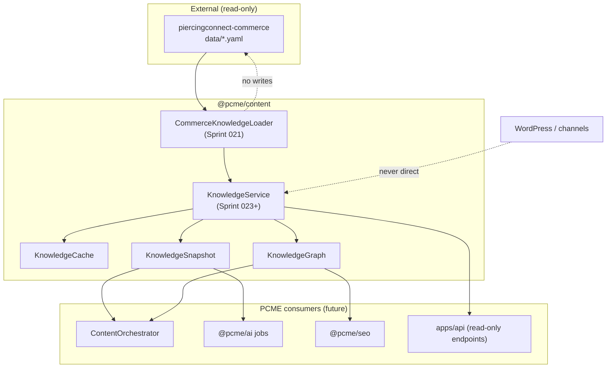
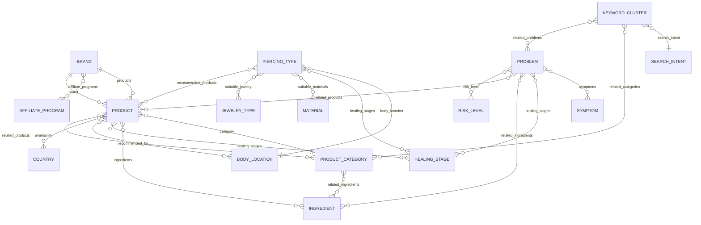
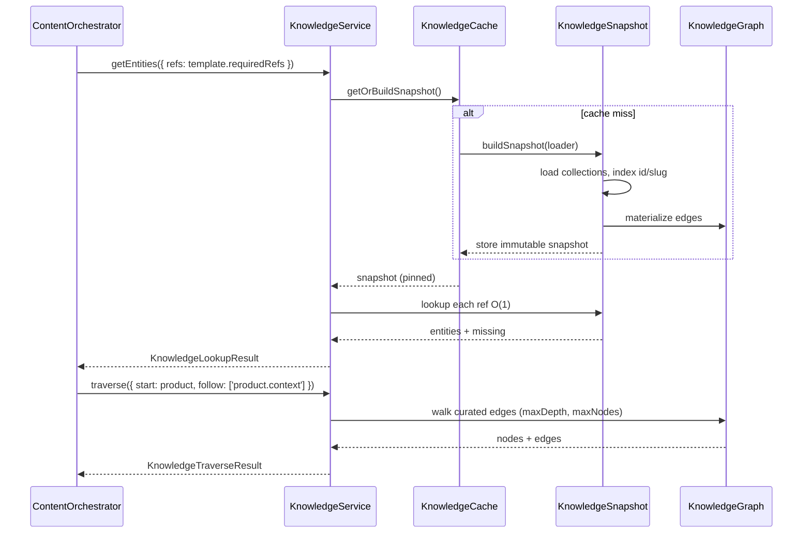
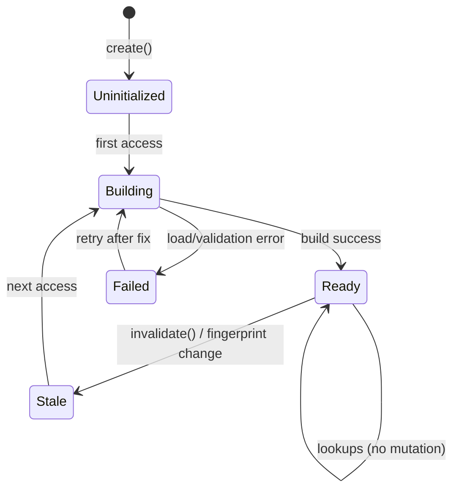
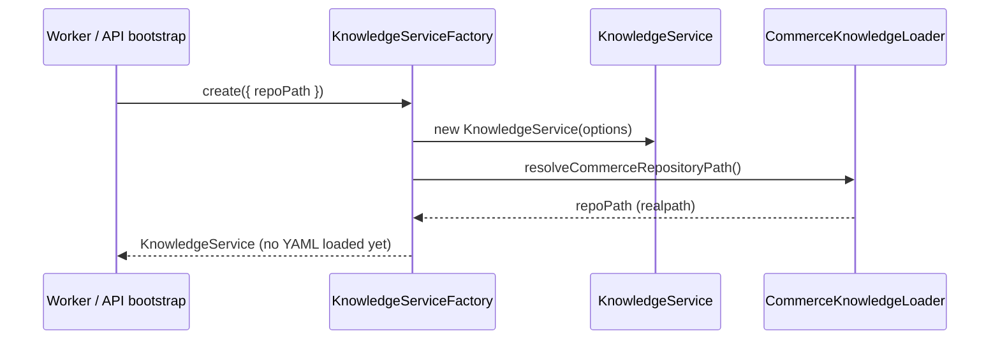
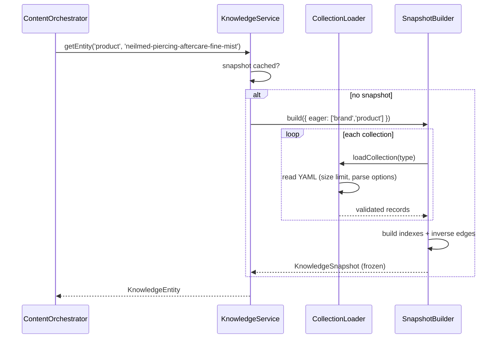
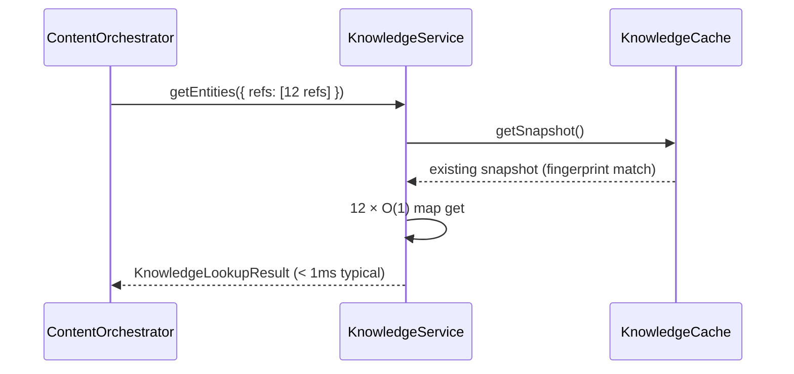
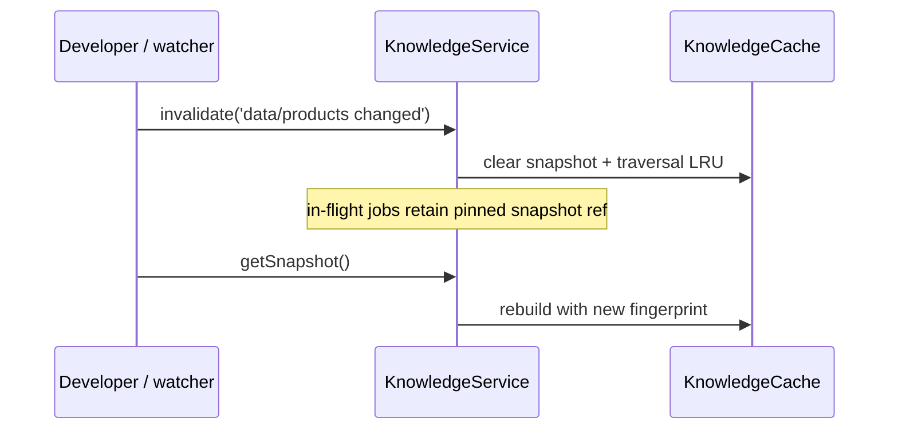

# Knowledge Service Architecture

Version: 0.1 (Sprint 022 design)

Status: Draft — architecture only, no production implementation

Project: PC Media Engine (`@pcme/content`)

Related:

- Commerce loader (Sprint 021 / 021.1): `packages/content/src/commerce/`
- Knowledge Core source: `piercingconnect-commerce` (`data/`, `schemas/`, `templates/`)
- Content generation contract: `piercingconnect-commerce/docs/content-generation-architecture.md`

---

## Purpose

Define the public API and internal boundaries for a **Knowledge Service** that sits between:

1. **External knowledge sources** (today: local `piercingconnect-commerce` YAML; future: exports, git sync, read-only bundles)
2. **PCME consumers** (Content Orchestrator, AI jobs, SEO, templates, dashboard — not WordPress directly)

The Knowledge Service answers: *“Given stable entity IDs and a template contract, return validated, immutable knowledge snapshots and graph traversals — offline-first, cacheable, and safe to scale to thousands of entities.”*

This document is **design only**. No production code ships in Sprint 022.

---

## 1. Service Boundaries

### What the Knowledge Service owns

| Responsibility | In scope |
|----------------|----------|
| Resolve knowledge source location | Yes — wraps hardened commerce loader |
| Load entity records by type + id | Yes |
| Validate required identity fields | Yes — id, slug, name minimum; schema rules per type later |
| Build in-memory indexes (id → record, slug → id) | Yes |
| Expose immutable snapshots | Yes |
| Graph traversal over declared relationships | Yes |
| Cache snapshots and hot lookups | Yes |
| Fail closed on missing entities, invalid refs, draft policy flags | Yes |

### What the Knowledge Service does **not** own

| Responsibility | Owner |
|----------------|-------|
| YAML file I/O hardening | `@pcme/content/commerce` loader (existing) |
| AI prompt generation / LLM calls | `@pcme/ai` |
| Template prose / channel rendering | `@pcme/content` orchestrator + `@pcme/publishing/rendering` |
| WordPress or any publish API | `@pcme/publishing` / plugins |
| Persisting generated content | `@pcme/database` |
| Editing knowledge records | `piercingconnect-commerce` repository (human workflow) |
| Search volume / CPC invention | Forbidden — keyword clusters supply editorial intent only |

### Boundary diagram



### Dependency rules (aligned with module map)

- `KnowledgeService` lives in **`packages/content`** under `src/knowledge/`.
- It **may depend on** `src/commerce/` (loader, path security, errors).
- It **must not depend on** `@pcme/ai`, `@pcme/database`, apps, plugins, or providers.
- Consumers depend on **public interfaces** exported from `@pcme/content/knowledge` — not on loader internals.

---

## 2. Entity Relationships

### Entity types (Knowledge Core taxonomy)

All entities share a common identity contract:

```typescript
interface KnowledgeEntityRef {
  type: KnowledgeEntityType;
  id: string; // stable kebab-case id, matches YAML filename stem
}

type KnowledgeEntityType =
  | 'brand'
  | 'product'
  | 'ingredient'
  | 'problem'
  | 'healing-stage'
  | 'piercing-type'
  | 'body-location'
  | 'material'
  | 'jewelry-type'
  | 'product-category'
  | 'symptom'
  | 'risk-level'
  | 'keyword-cluster'
  | 'search-intent'
  | 'affiliate-program'
  | 'country'
  | 'content-asset'
  | 'template';
```

Sprint 021 loads **brand** and **product** only. The service API is designed for all types; loaders register per `data/{collection}/` directory.

### Relationship model

Relationships are **directed edges** declared in YAML as:

- Scalar foreign keys: `brand: neilmed`, `category: sterile-saline-spray`
- ID arrays: `ingredients: [sterile-water, ...]`, `healing_stages: [...]`
- Inverse indexes built at snapshot time: `brand.products[]`, `category.products[]`



### Edge registry (declarative)

Each entity type declares outbound edges in a **relationship manifest** (implementation detail, not public API):

| From type | Field(s) | To type | Cardinality |
|-----------|----------|---------|-------------|
| product | `brand` | brand | N:1 |
| product | `category` | product-category | N:1 |
| product | `ingredients[]` | ingredient | N:M |
| product | `healing_stages[]` | healing-stage | N:M |
| brand | `products[]` | product | 1:N |
| piercing-type | `body_location` | body-location | N:1 |
| problem | `symptoms[]` | symptom | N:M |
| keyword-cluster | `search_intent` | search-intent | N:1 |

Inverse edges are **derived at index time**, not stored in YAML twice.

### Reference integrity rules

1. **Hard refs** (template-required): missing target → `KnowledgeReferenceError`, fail resolution.
2. **Soft refs** (optional arrays): missing target → omitted from traversal result + warning in snapshot metadata (configurable strict mode).
3. **Draft entities**: included in snapshot; consumers check `review.status` (generation checklist).
4. **No orphan policy** (taxonomy Rule 1): validation warnings at snapshot build, not blocking for MVP.

---

## 3. Lookup API

### Public surface (TypeScript interfaces — design)

```typescript
/** Factory: create a service bound to a knowledge source. */
interface KnowledgeServiceFactory {
  create(options?: KnowledgeServiceOptions): Promise<KnowledgeService>;
}

/** Primary consumer-facing API. */
interface KnowledgeService {
  /** Return current immutable snapshot (lazy-builds on first call). */
  getSnapshot(): Promise<KnowledgeSnapshot>;

  /** O(1) lookup after snapshot is materialized. */
  getEntity<T extends KnowledgeEntityType>(
    type: T,
    id: string,
  ): Promise<KnowledgeEntity<T> | null>;

  /** Resolve by slug within a type (unique per collection). */
  getEntityBySlug<T extends KnowledgeEntityType>(
    type: T,
    slug: string,
  ): Promise<KnowledgeEntity<T> | null>;

  /** Batch lookup — preferred for template resolution. */
  getEntities(request: KnowledgeLookupRequest): Promise<KnowledgeLookupResult>;

  /** Graph API — see section 4. */
  traverse(request: KnowledgeTraverseRequest): Promise<KnowledgeTraverseResult>;

  /** Explicit cache invalidation (e.g. after git pull in dev). */
  invalidate(reason?: string): void;

  /** Snapshot metadata without loading full graph. */
  describe(): Promise<KnowledgeSourceDescriptor>;
}
```

### Lookup request / result

```typescript
interface KnowledgeLookupRequest {
  refs: KnowledgeEntityRef[];
  /** If true, null entries become errors instead of omitted. */
  strict?: boolean;
  /** Projection — default 'identity' for hot path; 'full' includes raw YAML fields. */
  projection?: 'identity' | 'summary' | 'full';
}

interface KnowledgeLookupResult {
  snapshotId: string;
  found: KnowledgeEntityMap; // keyed by `${type}:${id}`
  missing: KnowledgeEntityRef[];
  warnings: KnowledgeWarning[];
}

interface KnowledgeEntity<T extends KnowledgeEntityType = KnowledgeEntityType> {
  type: T;
  id: string;
  slug: string;
  name: string;
  reviewStatus?: 'draft' | 'active' | 'archived';
  summary?: string; // selected safe fields for AI prompts
  raw?: Record<string, unknown>; // only when projection: 'full'
}
```

### Lookup behavior

| Method | Complexity | Notes |
|--------|------------|-------|
| `getEntity(type, id)` | O(1) | Hash map on snapshot |
| `getEntityBySlug(type, slug)` | O(1) | Secondary index per type |
| `getEntities(batch)` | O(k) | Single snapshot pin; k = refs.length |
| `describe()` | O(1) | Counts, version, source path, build time |

### Error types (public)

```typescript
class KnowledgeServiceError extends Error {}
class KnowledgeSnapshotError extends KnowledgeServiceError {} // build failed
class KnowledgeReferenceError extends KnowledgeServiceError {
  readonly ref: KnowledgeEntityRef;
  readonly snapshotId: string;
}
class KnowledgeEntityNotFoundError extends KnowledgeReferenceError {}
```

Errors expose **message + ref + snapshotId** — never raw YAML or parser `cause` in default formatting.

---

## 4. Graph Traversal API

### Use cases

- Template engine: “load product → brand → category → ingredients”
- SEO pillar pages: “keyword cluster → related problems → piercing types”
- Comparison articles: “product → alternatives → sibling products same category”

### Public API

```typescript
interface KnowledgeTraverseRequest {
  start: KnowledgeEntityRef;
  /** Named traversals — stable, documented, not arbitrary graph queries. */
  follow: KnowledgeTraversalSpec[];
  maxDepth?: number; // default 3, hard cap 5
  maxNodes?: number; // default 100, hard cap 500
  /** Stop traversing into these types (e.g. exclude affiliate-program for safety prompts). */
  excludeTypes?: KnowledgeEntityType[];
  projection?: 'identity' | 'summary' | 'full';
}

type KnowledgeTraversalSpec =
  | { edge: string } // manifest edge name, e.g. 'product.brand'
  | { edge: string; filter?: (entity: KnowledgeEntity) => boolean };

interface KnowledgeTraverseResult {
  snapshotId: string;
  start: KnowledgeEntityRef;
  nodes: KnowledgeEntityMap;
  edges: KnowledgeTraversedEdge[];
  truncated: boolean;
  warnings: KnowledgeWarning[];
}

interface KnowledgeTraversedEdge {
  from: KnowledgeEntityRef;
  to: KnowledgeEntityRef;
  edge: string;
}
```

### Named traversals (curated, not free-form)

Examples registered in the service:

| Traversal key | Path |
|---------------|------|
| `product.context` | product → brand → category → ingredients (depth-limited) |
| `product.aftercare` | product → healing_stages → problems (soft) |
| `piercing-type.guide` | piercing-type → body_location → healing_stages → recommended_products |
| `keyword-cluster.content` | keyword-cluster → search_intent → related_categories / related_problems |
| `brand.catalog` | brand → products → category |

Free-form recursive YAML walking is **not** exposed — prevents unbounded traversals and keeps behavior testable.

### Sequence: template entity resolution



---

## 5. Caching Strategy

### Cache layers

| Layer | Key | TTL | Invalidation |
|-------|-----|-----|--------------|
| L0 — Process snapshot | `sourceFingerprint` | Until `invalidate()` or process exit | Manual, file watcher (dev), or repo hash change |
| L1 — Entity index | Part of snapshot | Immutable with snapshot | Snapshot rebuild |
| L2 — Traversal result | `snapshotId + traverseRequestHash` | Short (in-memory LRU, 100 entries) | Snapshot invalidation |

### Source fingerprint

```typescript
interface KnowledgeSourceDescriptor {
  repoPath: string;
  sourceFingerprint: string; // hash of collection mtimes + file counts
  entityCounts: Partial<Record<KnowledgeEntityType, number>>;
  builtAt?: string; // ISO timestamp when snapshot last built
  schemaVersion: string; // e.g. '1.0'
}
```

Fingerprint computed from:

- Per-collection: file count, aggregate mtime, total bytes (cheap stat pass)
- **Not** full file content hash on every request (too expensive at scale)

Optional dev mode: watch `data/**` and call `invalidate()` on change.

### Cache rules

1. **Snapshots are immutable** — never mutate in place; rebuild produces new `snapshotId`.
2. **Readers pin snapshot** for duration of a request/job (lookup + traverse see consistent graph).
3. **No distributed cache in MVP** — single process LRU is sufficient for worker/API instances loading local repo.
4. **Future**: optional Redis snapshot keyed by git SHA for multi-worker deployments (design hook only).

---

## 6. Lazy vs Eager Loading

### Default: lazy snapshot build

| Phase | When | Work |
|-------|------|------|
| Service `create()` | Startup | Resolve repo path only |
| First `getSnapshot()` / `getEntity()` | First consumer call | Load collections per **registry priority** |
| `getEntities(templateRefs)` | Request time | O(k) map lookups on existing indexes |
| `traverse()` | Request time | Load only nodes reachable on curated edges |

### Eager options (explicit opt-in)

```typescript
interface KnowledgeServiceOptions {
  repoPath?: string;
  /** Eager-load these collections at snapshot build. Default: ['brand', 'product']. */
  eagerCollections?: KnowledgeEntityType[];
  /** Precompute inverse indexes (brand→products). Default: true for commerce types. */
  precomputeInverseIndexes?: boolean;
  /** Pre-warm curated traversals. Default: false. */
  prewarmTraversals?: string[];
  maxYamlFileBytes?: number;
  maxAliasCount?: number;
  strictReferences?: boolean;
}
```

### Collection loading tiers

| Tier | Collections | Rationale |
|------|-------------|-----------|
| Tier 0 (always for MVP) | brand, product | Sprint 021 loader; smallest commercial core |
| Tier 1 (on first ref) | ingredient, product-category, healing-stage | Common template deps |
| Tier 2 (on first ref) | problem, piercing-type, body-location, keyword-cluster | Content guides |
| Tier 3 (on first ref) | material, jewelry-type, symptom, risk-level, search-intent, affiliate-program, country | Larger taxonomies |

**Lazy collection load**: when a lookup misses an unloaded collection, load that collection only, merge into **new** snapshot version (copy-on-write indexes).

### Why lazy first

- Keeps smoke tests and single-product workflows fast.
- Avoids loading 2,000+ YAML files when generating one product review.
- Eager mode available for batch jobs: `eagerCollections: ['*']` (explicit).

---

## 7. Immutable Snapshot Model

### Core types

```typescript
interface KnowledgeSnapshot {
  readonly id: string; // uuid v7 or content hash
  readonly source: KnowledgeSourceDescriptor;
  readonly createdAt: string;

  /** O(1) primary index */
  readonly entities: ReadonlyMap<string, KnowledgeEntity>; // key: `${type}:${id}`

  /** O(1) slug index per type */
  readonly slugs: ReadonlyMap<string, ReadonlyMap<string, string>>; // type → slug → id

  /** Adjacency lists for curated traversals */
  readonly graph: Readonly<KnowledgeGraphView>;

  /** Build warnings (soft refs, draft entities, orphan warnings) */
  readonly warnings: readonly KnowledgeWarning[];
}

interface KnowledgeGraphView {
  neighbors(ref: KnowledgeEntityRef, edge: string): readonly KnowledgeEntityRef[];
  hasEdge(from: KnowledgeEntityRef, edge: string, to: KnowledgeEntityRef): boolean;
}
```

### Immutability rules

1. Snapshot object is **frozen** after build (`Object.freeze` / readonly maps).
2. `KnowledgeService.getSnapshot()` returns the **same instance** until invalidation.
3. Partial collection loads produce a **new** snapshot; old snapshot remains valid for in-flight jobs.
4. Consumers must not mutate `raw` documents — use projections for AI (`summary` strips affiliate internals if configured).

### Snapshot lifecycle



### Relation to Sprint 021 `CommerceKnowledgeSnapshot`

Sprint 021 snapshot is **loader-level** (brands + products arrays, repo path).

Sprint 022+ **KnowledgeSnapshot** is **service-level**:

- Typed entity map across all collections
- Graph indexes
- Metadata and warnings
- Stable `snapshotId` for cache keys

The commerce loader remains a **private adapter** — not the public consumer API.

---

## 8. Sequence Diagrams

### 8.1 Service bootstrap (lazy)



### 8.2 Snapshot build on first lookup



### 8.3 Cache hit path



### 8.4 Invalidation (dev / repo update)



---

## 9. Package Layout

Proposed structure inside `@pcme/content` (no implementation in Sprint 022):

```
packages/content/
├── src/
│   ├── commerce/                    # Sprint 021 — I/O adapter (existing)
│   │   ├── loader.ts
│   │   ├── paths.ts
│   │   ├── path-security.ts
│   │   └── ...
│   │
│   ├── knowledge/                   # Sprint 023+ — public service
│   │   ├── index.ts                 # public exports only
│   │   ├── types.ts                 # KnowledgeService, Snapshot, Ref types
│   │   ├── errors.ts
│   │   ├── constants.ts
│   │   │
│   │   ├── service/
│   │   │   ├── knowledge-service.ts       # implements KnowledgeService
│   │   │   ├── knowledge-service-factory.ts
│   │   │   └── options.ts
│   │   │
│   │   ├── snapshot/
│   │   │   ├── snapshot-builder.ts
│   │   │   ├── snapshot-store.ts          # immutable store + pin semantics
│   │   │   └── fingerprint.ts
│   │   │
│   │   ├── indexes/
│   │   │   ├── entity-index.ts            # id + slug maps
│   │   │   └── inverse-index.ts           # brand → products[]
│   │   │
│   │   ├── graph/
│   │   │   ├── relationship-manifest.ts   # declarative edges per type
│   │   │   ├── graph-view.ts
│   │   │   └── traversals.ts              # named traversal registry
│   │   │
│   │   ├── loaders/
│   │   │   ├── collection-loader.ts       # generic YAML collection loader
│   │   │   ├── commerce-adapter.ts        # wraps commerce/ for brand+product
│   │   │   └── collection-registry.ts     # type → data dir mapping
│   │   │
│   │   ├── cache/
│   │   │   ├── knowledge-cache.ts
│   │   │   └── traversal-lru.ts
│   │   │
│   │   ├── projection/
│   │   │   ├── summary-projection.ts      # AI-safe field subset
│   │   │   └── identity-projection.ts
│   │   │
│   │   └── __tests__/
│   │       ├── lookup.test.ts
│   │       ├── traverse.test.ts
│   │       ├── snapshot-immutability.test.ts
│   │       └── cache-invalidation.test.ts
│   │
│   ├── scripts/
│   │   ├── commerce-knowledge-smoke.ts    # existing
│   │   └── knowledge-service-smoke.ts     # future: counts + sample traverse
│   │
│   └── index.ts                           # re-export commerce + knowledge public API
│
└── README.md
```

### Public export map (`@pcme/content/knowledge`)

```typescript
// Consumer-facing — stable
export type { KnowledgeService, KnowledgeSnapshot, KnowledgeEntityRef, ... };
export { createKnowledgeService } from './knowledge/service/knowledge-service-factory.js';
export { KnowledgeEntityNotFoundError, ... } from './knowledge/errors.js';

// NOT exported: loaders, path-security, raw commerce types (unless explicitly needed)
```

### Scripts (future)

```json
{
  "knowledge:smoke": "tsx src/scripts/knowledge-service-smoke.ts"
}
```

Root `package.json`:

```json
{
  "knowledge:smoke": "pnpm --filter @pcme/content knowledge:smoke"
}
```

---

## 10. Scalability to Thousands of Entities

### Why this design scales

| Factor | Approach | Effect at 1k–10k entities |
|--------|----------|---------------------------|
| **O(1) lookup** | Hash maps keyed by `type:id` and `type:slug` | Constant time per template ref |
| **Lazy collection loading** | Load taxonomies only when referenced | Startup ≠ O(all files) |
| **Immutable snapshots** | Readers never lock; copy-on-write on reload | Safe concurrent jobs in one worker |
| **Cheap fingerprint** | mtime + count, not full rehash | Fast stale detection |
| **Bounded traversal** | `maxDepth`, `maxNodes`, named edges only | Prevents exponential graph blow-up |
| **Batch API** | `getEntities({ refs: [...] })` | One snapshot pin for entire template |
| **Projection layers** | `identity` / `summary` / `full` | AI jobs avoid multi-MB `raw` payloads |
| **Per-file limits** | 1 MB YAML cap (Sprint 021.1) | Memory bounded per entity |
| **No DB round-trips** | In-memory graph over flat files | Sub-millisecond lookups after build |
| **Horizontal scale (future)** | Snapshot keyed by git SHA | Each worker loads read-only bundle once |

### Order-of-magnitude estimates

Assumptions: 3,000 entities, ~5 KB average parsed record, 18 collections.

| Operation | Cold (first snapshot, tier 0+1) | Warm (cached) |
|-----------|-----------------------------------|---------------|
| Load brand + product (~18 files today) | ~50 ms | 0 |
| Load all 3k entities | ~200–800 ms (disk + parse) | 0 |
| Single `getEntity` | O(1) after index | < 0.1 ms |
| Template batch 15 refs | O(15) | < 1 ms |
| Curated traverse depth 3 | O(nodes), cap 100 | < 5 ms |

Memory: 3,000 × 5 KB ≈ 15 MB parsed + indexes ≈ **20–40 MB** per snapshot — acceptable for Node workers.

### Growth path beyond thousands

1. **Collection sharding** — load only collections referenced by template type.
2. **Export bundles** — precompiled JSON snapshot in `piercingconnect-commerce/exports/` for O(1) disk read (optional future).
3. **Read replicas** — workers share snapshot via memory-mapped bundle or Redis (design hook in cache layer).
4. **Strict graph catalog** — new edges require manifest update + tests, preventing accidental complexity.

---

## Implementation Roadmap (post–Sprint 022)

| Sprint | Deliverable |
|--------|-------------|
| 021 ✅ | Commerce loader (brand, product) |
| 021.1 ✅ | Loader hardening |
| **022** ✅ | Architecture doc (this document) |
| 023 | `KnowledgeSnapshot` + lookup API for brand/product |
| 024 | Collection registry + lazy load tier 1 collections |
| 025 | Graph traversal + template resolution helper |
| 026 | Content Orchestrator integration (still no WordPress) |
| 027 | AI projection layer (`summary` fields) |

---

## Open Decisions

1. **Strict vs soft missing refs** — default soft with warnings; templates declare strict mode.
2. **Snapshot persistence** — in-memory only for MVP; export bundle is optional optimization.
3. **Affiliate field filtering** — `summary` projection excludes commission rates from AI prompts by default.
4. **Multi-repo sources** — out of scope; single commerce root per service instance.

---

## Status

Sprint 022 complete: architecture and public API design documented. No production code committed.
